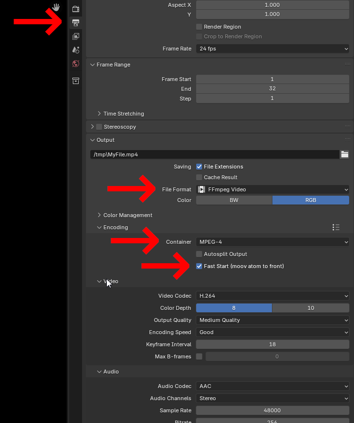
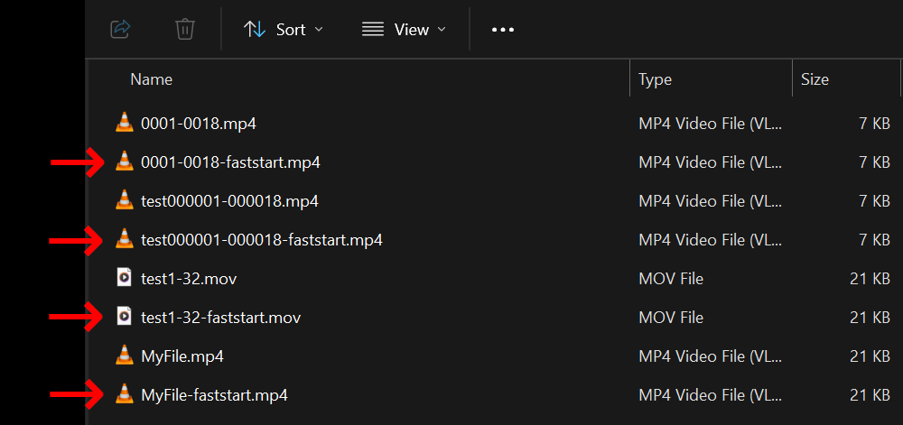
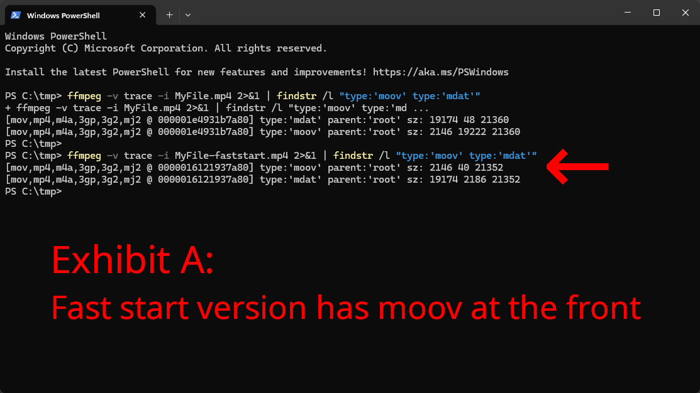
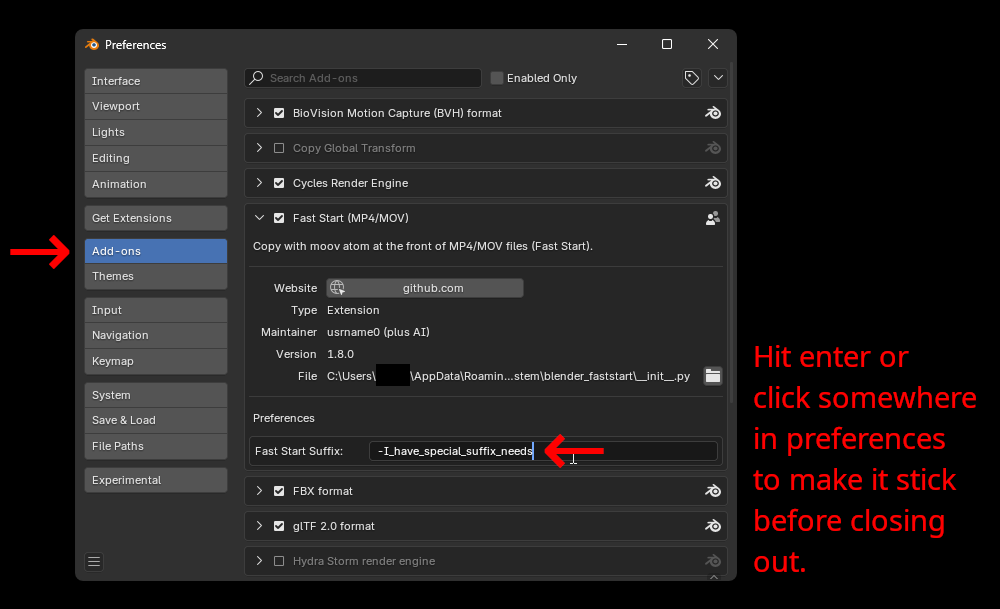

# BL Fast Start (MP4/MOV)
This is an extension for Blender 4.4+.

YouTube recommends MP4 + "moov atom at the front of the file (Fast Start)" so here's an extension for it. 

"BL Fast Start (MP4/MOV)" puts a checkbox on your output panel to add a 'Fast Start' copy of MP4 or MOV renders. It will create an extra MP4/MOV file with a custom suffix (default is '-faststart').  Your normal render is untouched so you'll have two files.  

In general "fast start" makes your video load a fraction of a second faster which can be handy if you're trying to make a loop with audio or trying to min/max your YouTube video performance or whatnot.

Credit to https://github.com/danielgtaylor/qtfaststart for the part of this extension that actually does all the work.

# Demo
 The checkbox shows up when you choose MPEG-4 (MP4) or QuickTime (MOV) output:
 
 
 
 Here's what the output looks like (testing different autonames):
 
 
 
 Demonstration of success:
 
 

# Bonus Feature

If you want to customize your suffix you can do so in preferences/addons.  Be sure to hit "enter" or click in the window somewhere because if you just "x" out of preferences Blender won't remember what you typed.  Characters that might break things are converted to _
 
 

# Installation

**From Blender.** Edit > Preferences > Get Extensions, search for "BL Fast Start",
and press Install.

**From a zip.** Download the latest
[zip](https://github.com/usrname0/BL_FastStart/releases) and install it as an
extension: Edit > Preferences > Add-ons, then the drop-down arrow at the top
right > Install from Disk, and pick the zip.
