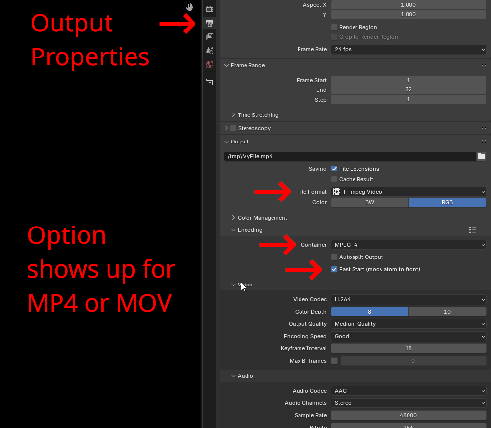
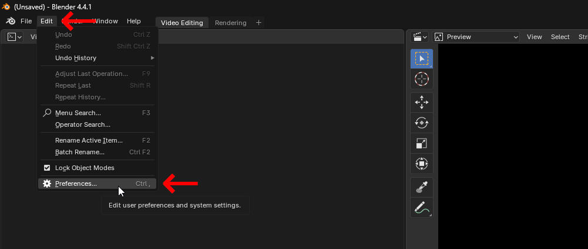

# blender_faststart
I'm going to make this public but don't use it yet unless you're willing to play guinea pig. 

This is an extension for Blender 4.4+. 

Youtube recommends MP4 + "moov atom at the front of the file (Fast Start)" so now here's an extension for it. Blender_faststart puts a checkbox on your output panel to add a 'Fast Start' copy of MP4 or MOV renders. It will create an extra MP4/MOV file with the suffix '-faststart' (your normal render is untouched).  This will make your video load a fraction of a second faster which can actually be handy if you're trying to make a loop with audio or whatnot.

Credit to https://github.com/danielgtaylor/qtfaststart for the part of this extension that actually does all the work.

 # Status
 This is currently working in Windows 11 and should theoretically work everywhere but that is untested.  I will be cleaning some things up shortly.

 # Demo
 Here's where to find the checkbox:
 
 
 
 Here's what the output looks like:
 
 
 
 Demonstration of success:
 
 

 # Manual Installation
 
 Download the [zip](https://github.com/usrname0/blender_faststart/blob/9b785b13095ca8e77b919fa0004dce2bce80589c/builds/blender_faststart-1.7.0.zip)
 
 
 
 
 
 
