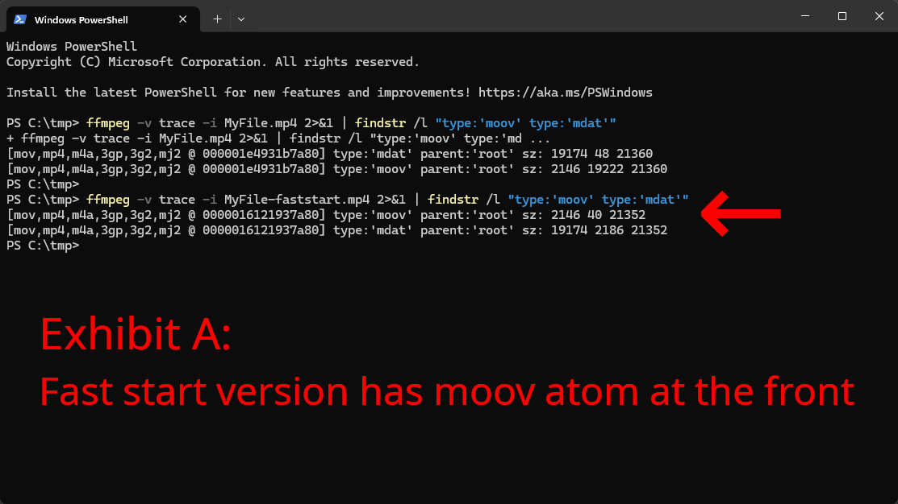

# Blender Fast Start (MP4/MOV)
I'm going to make this public but don't use it yet unless you're willing to play guinea pig. 

This is an extension for Blender 4.4+. 

YouTube recommends MP4 + "moov atom at the front of the file (Fast Start)" so here's an extension for it. 

Blender Fast Start puts a checkbox on your output panel to add a 'Fast Start' copy of MP4 or MOV renders. It will create an extra MP4/MOV file with a custom suffix (default is '-faststart').  Your normal render is untouched (safety first).  

Fast start will make your video load a fraction of a second faster which can actually be handy if you're trying to make a loop with audio or trying to min/max your YouTube video performance or whatnot.

Credit to https://github.com/danielgtaylor/qtfaststart for the part of this extension that actually does all the work.

 # Status
 This is currently working in Windows 11 and Linux Mint (Ubuntu Debian), it's all Python and should theoretically work everywhere but I can't test everything.  I will be cleaning some things up shortly.

 # Demo
 The checkbox shows up when you choose MPEG-4 (MP4) or QuickTime (MOV) output:
 
 
 
 Here's what the output looks like (testing different autonames):
 
 
 
 Demonstration of success:
 
 

 # Manual Installation
 
 Download the [zip](https://github.com/usrname0/blender_faststart/blob/c3f3f54a7823aa7bad27ec978637dae3640abfb9/builds/blender_faststart-1.8.0.zip)
 
 
 
 
 
 

# Bonus Feature

If you want to customize your suffix you can do so in preferences/addons.  Be sure to hit "enter" or click in the window somewhere because if you just "x" out of preferences Blender won't remember what you typed.  Characters that might break things are converted to "_".
 
 
